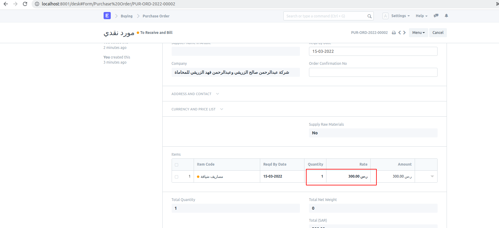

## Lc

customization for lc company

##### Note: Qty in SO / PO items table should always be 1 for this LC feature

**From SO and PO : It gives LC SI/PI option on submit**
It creates SI/PI for the pending amount on the second iteration of LC option click. Qty is always made to 1

**PO**

**PI on 1st iteration**

**PI on 2nd iteration‸**

#### License

MIT

